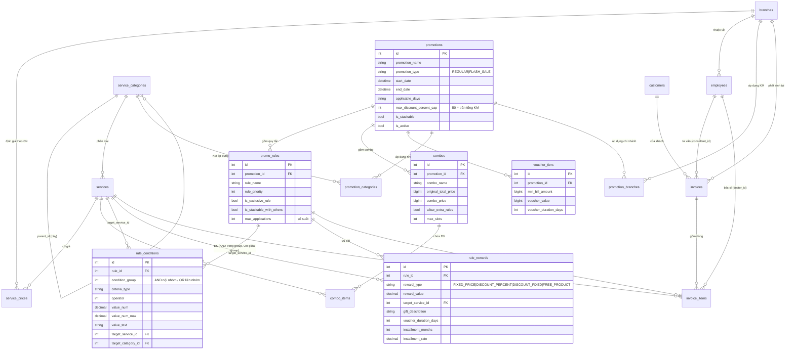

# Phân tích & hoàn thiện hệ thống bảng KHUYẾN MÃI (thammi_data_v2)

> Mục tiêu: đánh giá xem mô hình dữ liệu hiện tại đã đủ để **truy vấn dễ dàng các Chương trình Khuyến mãi (CTKM)** chưa, hoàn thiện các bảng còn thiếu, và vẽ sơ đồ liên kết (ER diagram).

---

## 1. Tổng quan 17 bảng hiện có

| Nhóm | Bảng | Số dòng | Vai trò |
|---|---|---:|---|
| **Danh mục** | `service_categories` | 111 | Cây phân loại dịch vụ (có `parent_id`, `category_level`) |
| | `services` | 2.269 | Dịch vụ gốc (master) |
| | `service_prices` | 2.269 | Giá gốc theo dịch vụ (hỗ trợ chi nhánh / loại giá) |
| | `branches` | 4 | Chi nhánh |
| **Con người** | `customers` | 0 | Khách hàng (rỗng) |
| | `employees` | 30 | Nhân viên (bác sĩ, tư vấn, thu ngân...) |
| **Khuyến mãi** | `promotions` | 2 | Header chiến dịch KM |
| | `promotion_categories` | 10 | M:N — KM áp dụng cho nhóm DV nào |
| | `promotion_branches` | 0 | M:N — KM áp dụng cho chi nhánh nào (**rỗng**) |
| | `promo_rules` | 340 | Quy tắc trong mỗi KM |
| | `rule_conditions` | 69 | Điều kiện áp dụng quy tắc |
| | `rule_rewards` | 340 | Phần thưởng/ưu đãi của quy tắc |
| | `combos` | 69 | Gói combo gắn với KM |
| | `combo_items` | 102 | Dịch vụ trong combo |
| | `voucher_tiers` | 4 | Mốc bill → giá trị voucher |
| **Giao dịch** | `invoices` | 0 | Hóa đơn (rỗng) |
| | `invoice_items` | 0 | Dòng hóa đơn (rỗng) |

### Enum đang dùng thực tế
- `rule_conditions.criteria_type`: `SERVICE_SELECTED` (60), `CUSTOMER_ATTRIBUTE` (3), `GROUP_SIZE` (2), `SERVICE_QTY` (2), `DAY_OF_WEEK` (2)
- `rule_conditions.value_text`: `STUDENT_TEACHER`, `PARENT_OF_EXCELLENT_STUDENT`, `MOTHER_AND_CHILD`, `WEEKEND`
- `rule_rewards.reward_type`: `FIXED_PRICE` (310), `DISCOUNT_PERCENT` (18), `DISCOUNT_FIXED` (11), `FREE_PRODUCT` (1)

---

## 2. Sơ đồ liên kết (ER Diagram)



---

## 3. Đánh giá: đã truy vấn dễ dàng CTKM chưa?

**Kết luận: ĐƯỢC ~70%.** Phần khung rules-engine (promotion → rule → condition/reward) thiết kế tốt, EAV linh hoạt, truy vấn được hầu hết KM lẻ. Nhưng còn **6 lỗ hổng** khiến không biểu diễn đúng file KM gốc, và **1 lỗi dữ liệu nặng**.

### ✅ Đã làm tốt
- Tách `condition` / `reward` theo từng `rule` → biểu diễn được KM phức tạp (đi nhóm, HSSV, theo dịch vụ...).
- `condition_group` cho phép logic **AND trong nhóm / OR giữa các nhóm**.
- `max_discount_percent_cap = 50` khớp ràng buộc *"Tổng KM không quá 50% giá gốc"*.
- Cờ stacking 3 tầng (`promotions.is_stackable`, `promo_rules.is_stackable_with_others`, `is_exclusive_rule`) → tính được KM có cộng dồn hay không.
- `voucher_tiers` khớp đúng bảng *"≥30tr giảm thêm 1tr..."*.

### ❌ Lỗ hổng cần bổ sung (xem mục 4)

| # | Lỗ hổng | KM gốc cần | Hiện trạng |
|---|---|---|---|
| G1 | **Giá theo bác sĩ** | "Làm với BS của mình" vs "Làm với BS khác" → 2 mức giá khác nhau | Không có `criteria_type` cho doctor |
| G2 | **Ưu đãi đổi theo mốc ngày** | "từ 18/5 giảm 2tr", đợt 1 (11–21/5) / đợt 2 (22–31/5) | `promo_rules` không có `valid_from/valid_to` |
| G3 | **Đếm suất đã dùng** | "10 suất đầu tiên giảm 50%, hết suất còn 43tr" | Có `max_applications`/`max_slots` nhưng **không có bộ đếm đã dùng** |
| G4 | **Loại trừ voucher với combo** | "voucher không áp dụng với combo siêu hời" | Không có cờ loại trừ |
| G5 | **`reward_value` lưu dạng text** | cần tính toán số | Trộn `"500000"` và `"1e+06"` |
| G6 | **`promotion_branches` rỗng** | KM áp dụng chi nhánh nào? | Chưa seed + chưa quy ước NULL=all |

### 🔴 Lỗi dữ liệu nghiêm trọng
- **`combos`: 40/69 dòng có `combo_price > original_total_price`** — tức "giá combo đắt hơn mua lẻ", vô lý. Hai cột bị **đảo giá trị** hoặc `original_total_price` chưa được tính từ `combo_items`.
  - VD combo #8: original `35tr` / combo `60tr`; combo #13: original `660k` / combo `100tr`.
  - ⇒ Cần script tính lại `original_total_price = Σ(service_prices của combo_items)` rồi đối chiếu.

---

## 4. Hoàn thiện hệ thống bảng (DDL đề xuất)

> Thay đổi tối thiểu, không phá khung cũ. Áp cho MySQL/MariaDB; chỉnh nhẹ nếu dùng SQLite.

### 4.1. Sửa kiểu & thêm cột (lỗ hổng G2, G3, G5)

```sql
-- G5: reward_value về numeric
ALTER TABLE rule_rewards
  MODIFY reward_value BIGINT NULL;

-- G2: ưu đãi đổi theo mốc ngày trong cùng 1 KM
ALTER TABLE promo_rules
  ADD COLUMN valid_from DATE NULL AFTER rule_name,
  ADD COLUMN valid_to   DATE NULL AFTER valid_from;

-- G3: đếm suất đã dùng (hoặc tính realtime từ invoice_items.applied_rule_id)
ALTER TABLE promo_rules
  ADD COLUMN slots_used INT NOT NULL DEFAULT 0 AFTER max_applications;
ALTER TABLE combos
  ADD COLUMN slots_used INT NOT NULL DEFAULT 0 AFTER max_slots;
```

### 4.2. Mở rộng enum điều kiện (lỗ hổng G1)

```sql
-- G1: thêm criteria_type = 'DOCTOR_TIER'
--     value_text: 'OWN_DOCTOR' | 'OTHER_DOCTOR'
-- (không cần ALTER nếu criteria_type là VARCHAR; chỉ cần thêm dữ liệu)
INSERT INTO rule_conditions (rule_id, condition_group, criteria_type, value_text)
VALUES (<rule_id>, 1, 'DOCTOR_TIER', 'OTHER_DOCTOR');
```

### 4.3. Cờ loại trừ voucher (lỗ hổng G4)

```sql
ALTER TABLE combos
  ADD COLUMN exclude_voucher TINYINT(1) NOT NULL DEFAULT 0;  -- combo siêu hời = 1
```

### 4.4. Khóa ngoại + index (giúp truy vấn nhanh & toàn vẹn)

```sql
ALTER TABLE promo_rules      ADD FOREIGN KEY (promotion_id) REFERENCES promotions(id);
ALTER TABLE rule_conditions  ADD FOREIGN KEY (rule_id)      REFERENCES promo_rules(id);
ALTER TABLE rule_rewards     ADD FOREIGN KEY (rule_id)      REFERENCES promo_rules(id);
ALTER TABLE combos           ADD FOREIGN KEY (promotion_id) REFERENCES promotions(id);
ALTER TABLE combo_items      ADD FOREIGN KEY (combo_id)     REFERENCES combos(id);
ALTER TABLE combo_items      ADD FOREIGN KEY (service_id)   REFERENCES services(id);
ALTER TABLE voucher_tiers    ADD FOREIGN KEY (promotion_id) REFERENCES promotions(id);

CREATE INDEX idx_rule_promo   ON promo_rules(promotion_id, is_exclusive_rule);
CREATE INDEX idx_cond_service ON rule_conditions(target_service_id);
CREATE INDEX idx_cond_rule    ON rule_conditions(rule_id, condition_group);
CREATE INDEX idx_reward_rule  ON rule_rewards(rule_id);
CREATE INDEX idx_prom_active  ON promotions(is_active, start_date, end_date);
```

### 4.5. Quy ước `promotion_branches` (lỗ hổng G6)
- **Quy ước:** nếu KM **không có dòng nào** trong `promotion_branches` ⇒ áp dụng **toàn hệ thống** (mọi chi nhánh). Nếu có ⇒ chỉ các chi nhánh được liệt kê. Ghi rõ quy ước này vào tài liệu API.

---

## 5. View hỗ trợ truy vấn nhanh CTKM

> Cung cấp 1 view "phẳng" để FE/tư vấn viên tra cứu nhanh thay vì JOIN tay 4–5 bảng.

```sql
CREATE VIEW v_promotion_offers AS
SELECT
    p.id              AS promotion_id,
    p.promotion_name,
    p.promotion_type,
    p.start_date, p.end_date,
    r.id              AS rule_id,
    r.rule_name,
    r.valid_from, r.valid_to,
    r.max_applications, r.slots_used,
    rw.reward_type,
    rw.reward_value,
    s_reward.item_name AS reward_service_name,
    rw.gift_description
FROM promotions p
JOIN promo_rules  r  ON r.promotion_id = p.id
JOIN rule_rewards rw ON rw.rule_id     = r.id
LEFT JOIN services s_reward ON s_reward.id = rw.target_service_id
WHERE p.is_active = 1;
```

**Ví dụ truy vấn thường gặp:**

```sql
-- "Dịch vụ X đang có KM gì còn hiệu lực hôm nay?"
SELECT * FROM v_promotion_offers o
JOIN rule_conditions c ON c.rule_id = o.rule_id
WHERE c.criteria_type = 'SERVICE_SELECTED'
  AND c.target_service_id = :service_id
  AND CURRENT_DATE BETWEEN o.start_date AND o.end_date;

-- "Bill 80tr được voucher bao nhiêu?"
SELECT voucher_value, voucher_duration_days
FROM voucher_tiers
WHERE promotion_id = :pid AND min_bill_amount <= 80000000
ORDER BY min_bill_amount DESC LIMIT 1;
```

---

## 6. Việc cần làm (ưu tiên)

1. **🔴 Sửa lỗi đảo giá `combos`** — chạy script tính lại `original_total_price` từ `combo_items` + `service_prices`, đối chiếu 40 dòng nghi vấn. *(Quan trọng nhất — đang sai logic giá.)*
2. **G5** đổi `reward_value` → numeric (tránh `1e+06` khi tính toán).
3. **G2/G3** thêm `valid_from/valid_to` + `slots_used` (để KM theo mốc ngày & đếm suất hoạt động đúng).
4. **G1** seed `DOCTOR_TIER` cho các KM phân biệt "BS của mình / BS khác".
5. **G6** quyết định quy ước branch + seed `promotion_branches` nếu cần.
6. Thêm FK + index (mục 4.4).
